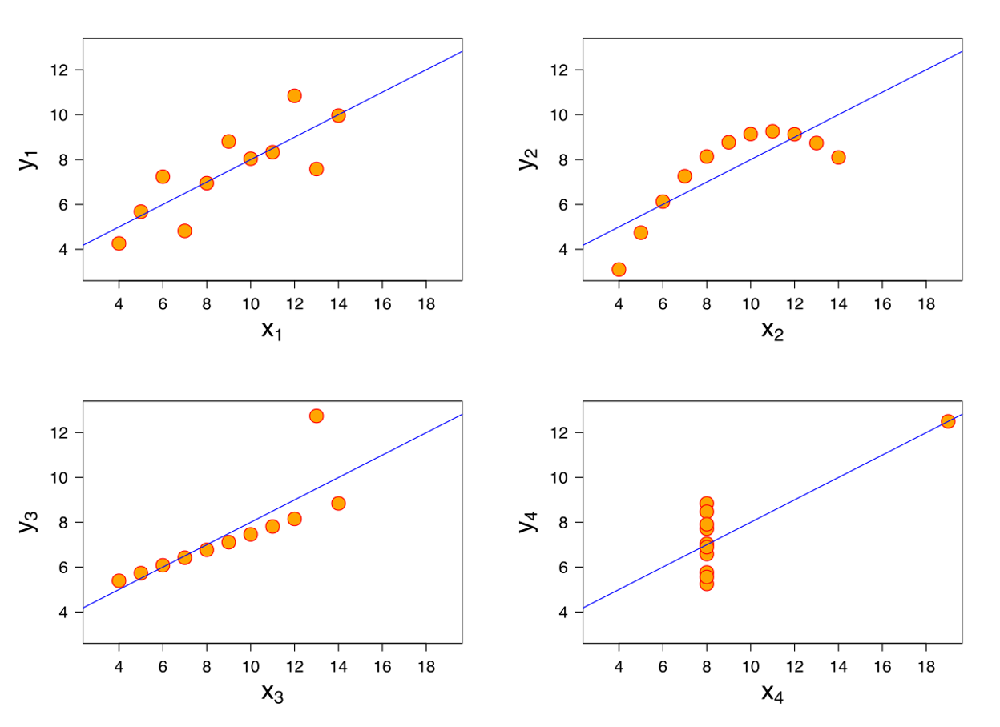
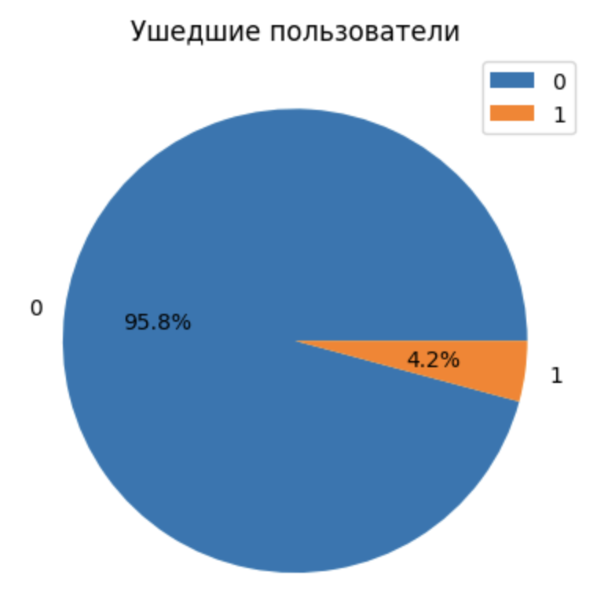
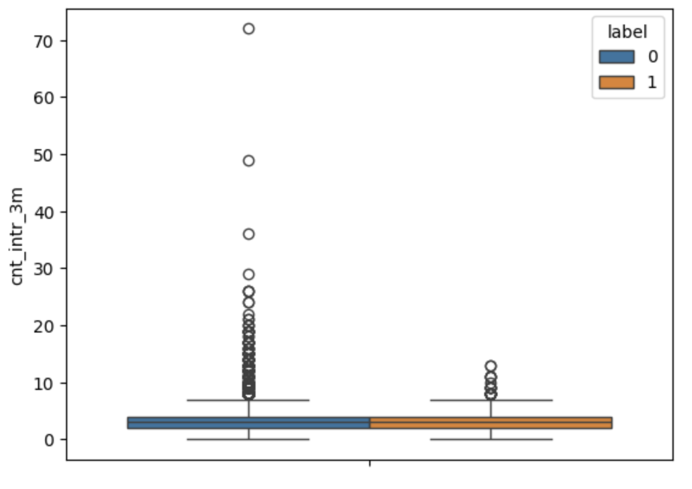
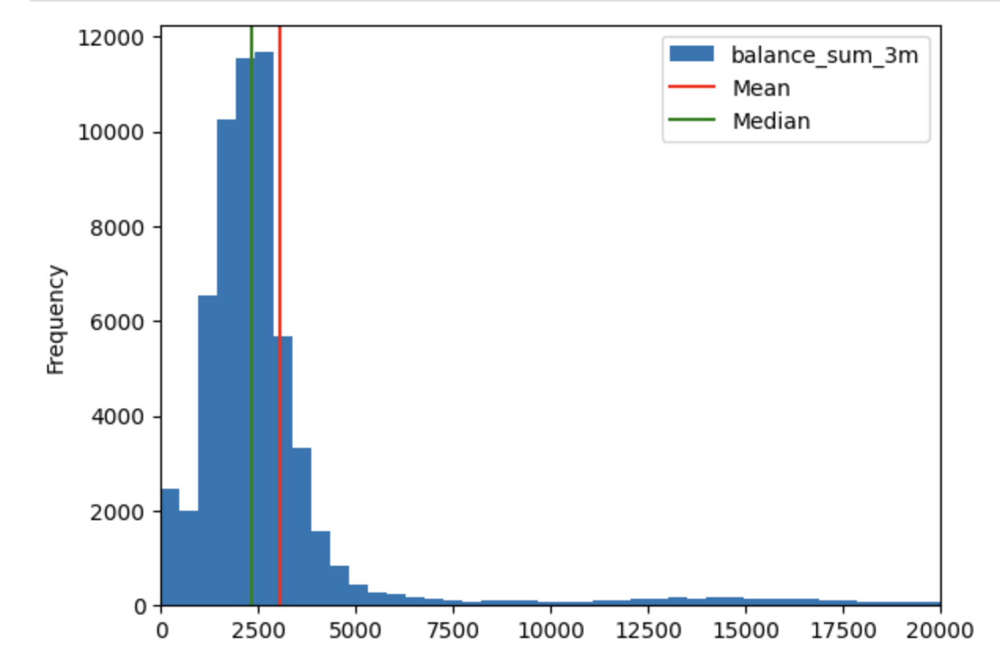

# Задание 01 — Дескриптивный и разведочный анализ
## Проект по дескриптивному и разведочному анализу
В рамках этого проекта ты начнешь лучше понимать данные за счет расчета простых базовых статистик и построения графиков.

## Оглавление

1. [Глава I](#глава-i) \
    1.1. [Преамбула](#преамбула)
2. [Глава II](#глава-ii) \
    2.1. [Цели](#цели)
3. [Глава III](#глава-iii) \
    3.1. [Задание](#задание)
4. [Глава IV](#глава-iv) \
    4.1. [Сдача работы и проверка](#сдача-работы-и-проверка)

## Глава I
### Преамбула

До сих пор мы довольно много говорили о качестве данных и уделили этому значительную часть времени, но не менее важным является этап «понимания» данных. Не обладая достаточным пониманием данных, не чувствуя их, сложно проводить предиктивный анализ. Порой это скорее похоже на блуждание в темноте и дергание разных рычагов и ручек. И наоборот, обладая достаточным пониманием данных, ты сможешь лучше интерпретировать то, что тебе будет выдавать модель машинного обучения, лучше принимать решения о том, где и что в ней стоит поменять. 

Дескриптивный и разведочный анализ данных по сути состоит из расчета простых статистик и построения графиков. Уже на этом этапе мы можем получить ценные для бизнеса инсайты. Либо можем выявить неточности и нестыковки в данных и сделать еще один шаг к улучшению качества датасета — и в целом процесса управления качеством данных в организации.

Хотим отдельно отметить пользу именно визуализации данных, потому что порой дескриптивные статистики в отдельности могут приводить нас к неверным выводам. Например, ниже ты можешь увидеть набор статистик:

<table>
  <tr>
   <td><strong>Статистика</strong>
   </td>
   <td><strong>Значение</strong>
   </td>
  </tr>
  <tr>
   <td>Среднее x
   </td>
   <td>9
   </td>
  </tr>
  <tr>
   <td>Дисперсия x
   </td>
   <td>11
   </td>
  </tr>
  <tr>
   <td>Среднее y
   </td>
   <td>7.50
   </td>
  </tr>
  <tr>
   <td>Дисперсия y
   </td>
   <td>4.125
   </td>
  </tr>
  <tr>
   <td>Корреляция между x и y
   </td>
   <td>0.816
   </td>
  </tr>
  <tr>
   <td>Линейная регрессия
   </td>
   <td>y = 3.00 + 0.5x
   </td>
  </tr>
  <tr>
   <td>Коэффициент детерминации
   </td>
   <td>0.67
   </td>
  </tr>
</table>

Если попытаться представить на одном графике x и y, то в голове рисуется вытянутое облако точек, ось которого проходит где-то по диагонали графика. И кажется, что это единственный вариант представить расположение точек, согласующееся с этими характеристиками.

Но это не так, и существует несколько способов, как может выглядеть расположение.

Это так называемый квартет Энскомба.

Поэтому вывод следующий. Если тебе говорят только среднюю, этого недостаточно. Нужно понимать, а какая вариация у признака. Возможно, среднее ни о чем не говорит. Если тебе говорят о высоком коэффициенте корреляции, то этого тоже недостаточно — нужно посмотреть на расположение точек. Возможно, там есть экстремальные значения или значений очень мало. Если говорят о низком коэффициенте корреляции, то этого также недостаточно — возможно, зависимость есть, просто она нелинейная. И это снова сможет продемонстрировать график.

Сегодня ты этим и займешься.

## Глава II
### Цели
Расчет дескриптивных статистик — само по себе занятие несложное. К тому же, с точки зрения работы на платформе Kaggle, 
ты неплохо поднаторел в предыдущем проекте, и многие команды тебе уже знакомы. Да, придется кое-что самостоятельно 
поискать в Интернете, но кого это испугает после предыдущего проекта?

## Глава III
### Задание

Все необходимые материалы к этому проекту ты можешь найти по [ссылке](https://github.com/rgordeev/tvgu-masters-26-2024-task-01).

Сегодня ты будешь работать с датасетом, который собирал вчера по кусочкам. В собранном виде его можно найти в папке src/datasets - файлы с данными dataset_01_06.csv и dataset_07_12.csv за первую и вторую половину года соответственно. 

Сегодня тебе нужно будет рассчитывать разные дескриптивные статистики и строить графики.

Напомним, что ты продолжаешь работать на платформе Kaggle. MS Excel по-прежнему под запретом.  В ноутбуке проекта `src/day-01-assignment.ipynb` есть список команд, которые могут быть тебе полезны для реализации этого задания. Но на этот раз их меньше, чем в прошлый раз.

Итак, что тебе нужно будет сделать:

## Задание 1
Объедини датасеты `dataset_01_06` и `dataset_07_12` в один под названием `dataset`. \
Выведи размеры получившегося датасета.

## Задание 2
Пока у нас нет задачи изучить наших клиентов «в динамике», мы просто хотим описать нашего клиента. 

Давай создадим переменную `dataset_unique`. В нее сохраним **последние** данные об **уникальных** клиентах. В этом тебе поможет метод [drop_duplicates](https://pandas.pydata.org/pandas-docs/stable/reference/api/pandas.DataFrame.drop_duplicates.html) и его параметр `keep`.

Выведи количество строк получившегося датасета. Для того чтобы убедиться, что ты все выполнил верно, выполни код `assert len(dataset_unique) == 60699`. Он должен выполниться без ошибок.

## Задание 3
Построй круговую диаграмму [pie-plot](https://pandas.pydata.org/docs/reference/api/pandas.DataFrame.plot.pie.html) по количеству ушедших клиентов. За отток клиента отвечает признак `label`. 

Для того чтобы красиво дополнить график, добавь эти аргументы `autopct='%1.1f%%', legend=True, title='Ушедшие пользователи', ylabel=''` в метод `pie()`.

Какой процент пользователей отказался от наших услуг?

Ожидаемый результат (*изображение может отличаться по стилю):

## Задание 4
Первая гипотеза, которую все хотят проверить: если клиент часто обращается в поддержку, то ему что-то не нравится, и, возможно, он собирается отказаться от наших услуг (хотя на самом деле, часто все наоборот).

C помощью функции [sns.boxplot](https://seaborn.pydata.org/generated/seaborn.boxplot.html) построй график «ящик с усами» по количеству обращений клиента **за 3 месяца** по ушедшим и оставшимся клиентам. В этом тебе поможет аргумент `hue`.

Отличается ли медиана количества обращений у ушедших и оставшихся клиентов?

Ожидаемый результат:

## Задание 5
У нас имеются данные баланса клиента. Данные баланса клиента **за 3 месяца** собраны в колонке `balance_sum_3m`. Интересно посмотреть, сколько в среднем клиенты держат на счетах.

C помощью функции диаграммы [hist-plot](https://pandas.pydata.org/docs/reference/api/pandas.DataFrame.plot.hist.html) построй гистограмму баланса пользователей. Для функции `hist` используй аргумент `bins=200`. 

Также рассчитай среднее и медиану для колонки `balance_sum_3m`. Сохрани их в переменные `mean` и `median`. С помощью функции `plt.axvline` добавь эти статистики на гистограмму.

Ожидаемый результат:

## Задание 6
Надеемся, что за предыдущие задания у тебя уже появились гипотезы, которые ты бы хотел визуализировать.

Используя инструменты, с которыми ты познакомился ранее, визуализируй статистики, интересные уже лично тебе. Чем больше, тем лучше. :)

## Задание 7
Используя библиотеку [Plotly и функции Density Mapbox](https://plotly.com/python/mapbox-density-heatmaps/),
отрисуй тепловую карту клиентов по **времени жизни клиента**. 

Для этого тебе потребуется найти атрибуты, отвечающие за координаты клиентов (ширина, долгота) и атрибут времени 
жизни клиента. Найди, с каким суффиксом эти атрибуты хранятся в наших данных, и используй эти данные для построения тепловой карты.

## Глава IV
### Сдача работы и проверка

1. Сохрани решения в файле `day-01-assignment.ipynb`.
2. Сделай форк исходного репозитория на `github`
3. Закоммить изменения
4. Опубликуй изменения в своем форке
5. Сделай пулл реквест на исходный репозиторий. В комментарии пулл реквеста укажаи свое ФИО и группу